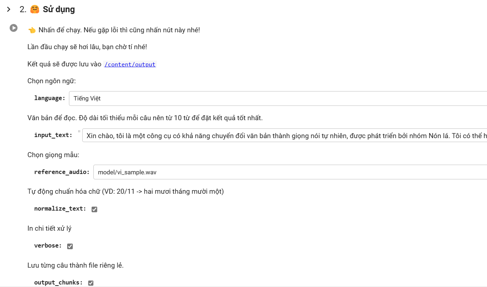
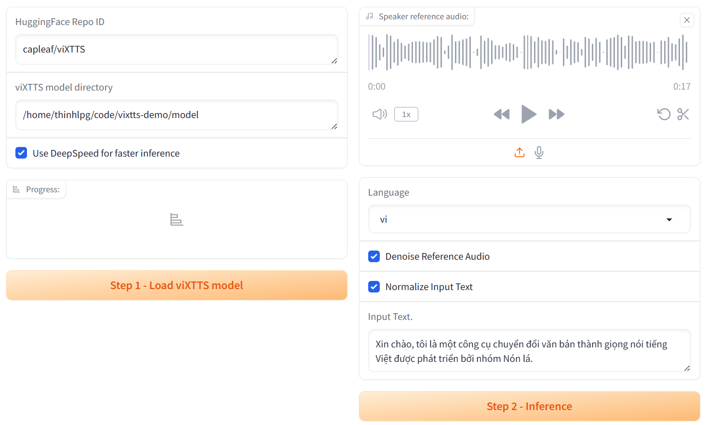

# viXTTS Demo

viXTTS is a text-to-speech voice generation tool that offers voice cloning voices in Vietnamese and other languages. This model is a fine-tuned version based on the [XTTS-v2.0.3](https://huggingface.co/coqui/XTTS-v2) model, utilizing the [viVoice](https://huggingface.co/datasets/capleaf/viVoice) dataset. This repository is primarily intended for inference purposes.

The model can be accessed at: [viXTTS on Hugging Face](https://huggingface.co/capleaf/viXTTS)

## Online usage (Recommended)

For a quick demonstration, please refer to [this notebook](./viXTTS_Demo.ipynb) on Google Colab.
Tutorial (Vietnamese): https://youtu.be/pbwEbpOy0m8?feature=shared

## Local Usage

This code is specifically designed for running on Ubuntu or WSL2. It is not intended for use on macOS or Windows systems (might available later).

### Hardware Recommendations

- At least 10GB of free disk space
- At least 16GB of RAM
- **Nvidia GPU** with a minimum of 4GB of VRAM
- By default, the model will utilize the GPU. In the absence of a GPU, it will run on the CPU and run much slower.

### Required Software

- Git
- Python version >=3.9 and <= 3.11. The default version is set to 3.11, but you can modify the Python version in the `run.sh` file.

### Usage

```bash
git clone https://github.com/thinhlpg/vixtts-demo
cd vixtts-demo
./run.sh
```
1. Run `run.sh` (dependencies will be automatically installed for the first run).
2. Access the Gradio demo link.
3. Load the model and wait for it to load.
4. Inference and Enjoy 🤗
5. The result will be saved in `output/`

## Limitation
- Subpar performance for input sentences under 10 words in Vietnamese language (yielding inconsistent output and odd trailing sounds).
- This model is only fine-tuned in Vietnamese. The model's effectiveness with languages other than Vietnamese hasn't been tested, potentially reducing quality.

## Acknowledgements

We would like to express our gratitude to all libraries, and resources that have played a role in the development of this demo, especially:

- [Coqui TTS](https://github.com/coqui-ai/TTS) for XTTS foundation model and inference code
- [Vinorm](https://github.com/v-nhandt21/Vinorm) and [Undethesea](https://github.com/undertheseanlp/underthesea) for Vietnamese text normalization
- [Deepspeed](https://github.com/microsoft/DeepSpeed) for fast inference
- [Huggingface Hub](https://huggingface.co/) for hosting the model
- [Gradio](https://www.gradio.app/) for web UI
- [DeepFilterNet](https://github.com/Rikorose/DeepFilterNet) for noise removal

## Contact

- You can message me directly on Facebook: <https://fb.com/thinhlpg/> (preferred 🤗)
- GitHub: <https://github.com/thinhlpg>
- Email: <thinhlpg@gmail.com> or <thinhlpgse161384@fpt.edu.vn>
